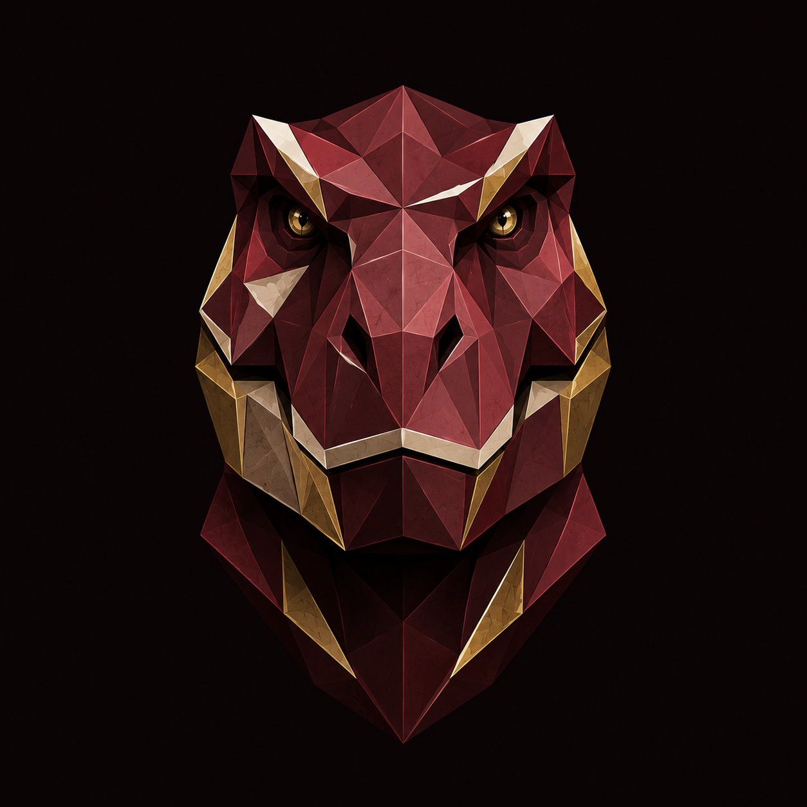

  

<h1 align="center">Manuel Alejandro Hernández Rentería</h1>

  Senior Frontend &amp; Fullstack Engineer · Frontend Technical Lead 
  Guadalajara, México

<em>Software, craft &amp; curiosity.</em>

  
  
  
  

## About

I build tools that help people — clean, secure, production software, made with a
collector's eye for detail. As a frontend technical lead I shape architecture and
mentor teams; I still reach for the backend whenever that's the right call.

I help product teams ship maintainable, accessible apps — and the systems behind them.

---

## Selected work

**No. 01 — Abe's Pottery API**  
`NestJS 11` · `Prisma 7` · `PostgreSQL 15`  
A race-safe stock and order system for a B2B pottery business. Concurrency-safe
inventory, clean domain modeling, and a typed API built to stay maintainable as the
catalog grows.

**No. 02 — APCL / IMT Pave**  
`Flutter` · `offline-first`  
A pavement-management app for field crews. Runs PCI scoring, a maintenance decision
tree, and a sustainability cost-index model fully offline — ported from legacy VBA
into a maintainable mobile app.

Case studies and more at <a href="https://rentheria.com">rentheria.com</a>.

---

## Toolbox

**Frontend** · `TypeScript` `Angular` `RxJS` `Tailwind`  
**Backend** · `NestJS` `Node.js` `Prisma` `PostgreSQL`  
**Mobile** · `Flutter` `Ionic`  
**Craft &amp; ops** · `Figma` `Accessibility (WCAG)` `Docker` `CI/CD`

---

Guadalajara, México · <em>construyo cosas que ayudan a las personas.</em>

